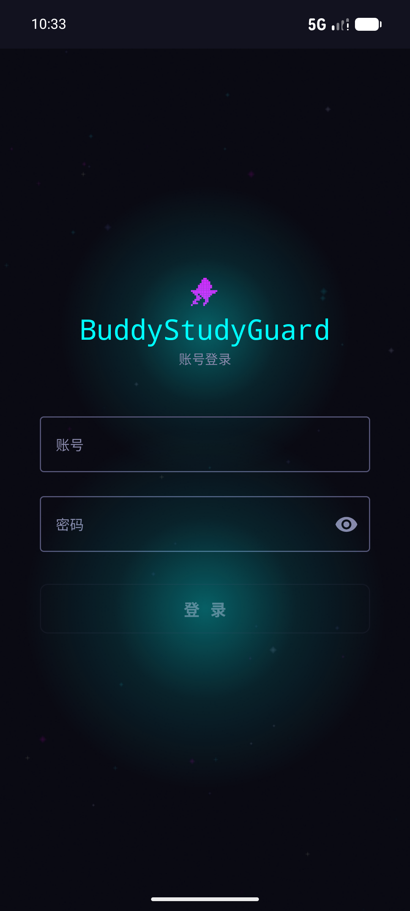
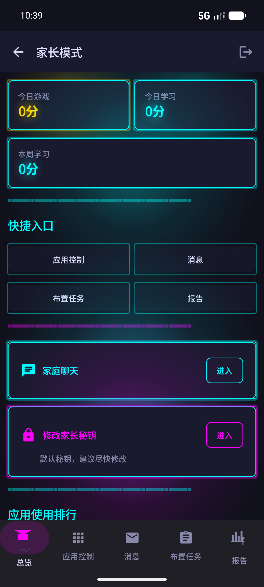
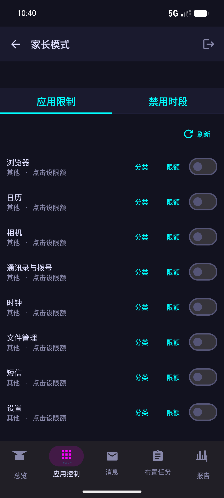
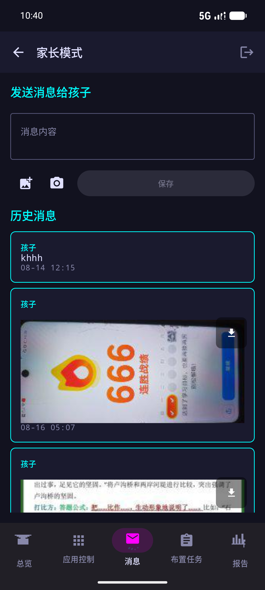
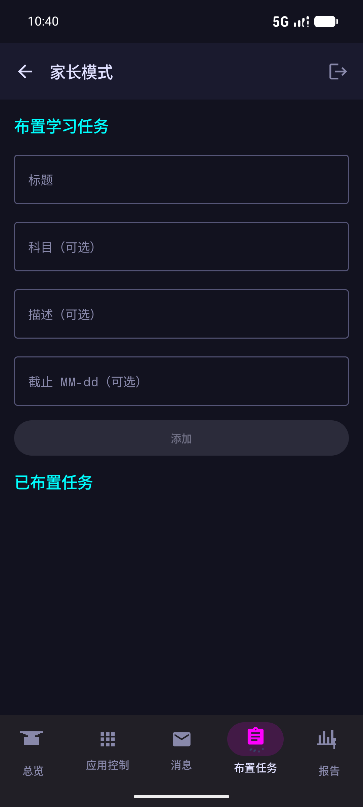
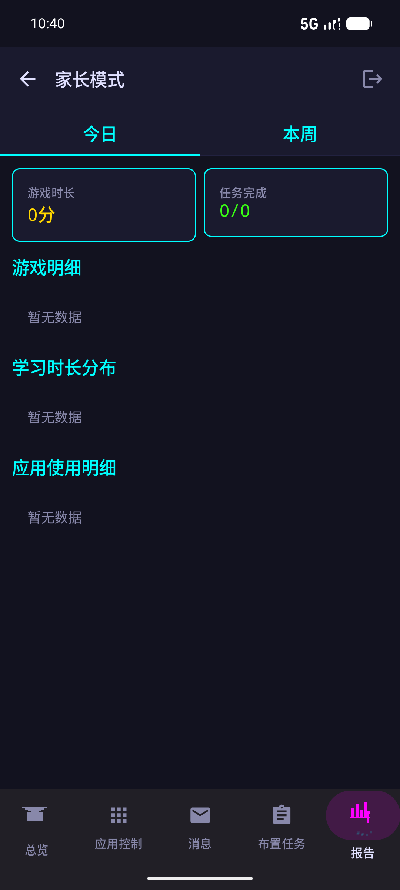

---
AIGC:
    Label: "1"
    ContentProducer: 001191440300708461136T1XGW3
    ProduceID: 061a0cddaa82373f1653d85953832b66_b72330c1994311f1a98a525400f8a581
    ReservedCode1: Q6TVqs98gCwj2fuXSwh8zoJEkh4QJIrqNrpPzPIzlLeua6CTXOxBqSVCql6hjL5JVmUvuwkRMHTk1utN4phAGa1jpi8ga6n9GCXCZjXjp5WWzhrek2gb34ST4u0pg4IZmWssH5T4WuoW+O6mXMmYgydQTrnf6hBlFi+ymasykFF7qgUfl1HolpsfHEI=
    ContentPropagator: 001191440300708461136T1XGW3
    PropagateID: 061a0cddaa82373f1653d85953832b66_b72330c1994311f1a98a525400f8a581
    ReservedCode2: Q6TVqs98gCwj2fuXSwh8zoJEkh4QJIrqNrpPzPIzlLeua6CTXOxBqSVCql6hjL5JVmUvuwkRMHTk1utN4phAGa1jpi8ga6n9GCXCZjXjp5WWzhrek2gb34ST4u0pg4IZmWssH5T4WuoW+O6mXMmYgydQTrnf6hBlFi+ymasykFF7qgUfl1HolpsfHEI=
---

# 弟管严 (BuddyStudyGuard)

> 家长管控孩子游戏时长的安卓助手，双端实时同步。

一款为弟弟开发的学习与监护 Android 应用，安装在他自己的手机上（弟弟完全知情并同意）。应用内分「孩子模式」和「家长模式」，家长端与学生端通过 CloudBase 云端实时同步限制规则、使用时长、消息、任务与应用清单，跨设备互通。

[](LICENSE)
[](https://developer.android.com)
[](https://kotlinlang.org)
[](https://github.com/Wang-qi-shuo/BuddyStudyGuard/releases)
[](https://github.com/Wang-qi-shuo/BuddyStudyGuard/actions)

## 功能特性

### 家长端
- **应用限制**：一键锁定应用、设置每日时长限额、配置禁用时段（按星期）
- **游戏时长统计**：按天/周查看孩子游戏与学习时长，自动识别游戏应用
- **实时聊天**：与孩子互发文字与图片消息，图片可一键保存到相册
- **布置任务**：创建学习任务并实时推送到孩子任务板
- **数据报告**：学习时长分布、游戏时长、任务完成度一目了然

### 学生端
- **限制拦截**：命中限制自动返回桌面并弹出全屏提醒
- **无障碍服务**：仅监听窗口状态变化，不读取任何界面内容
- **时长上报**：自动统计并上报应用使用时长到云端
- **聊天传图**：与家长互发文字/图片，图片支持保存到相册
- **AI 学习助手**：豆包大模型多轮对话，支持拍照提问，离线降级本地 FAQ

## 功能截图

| 登录页 | 家长总览 |
|--------|----------|
|  |  |
| 账号密码登录，自动加入家庭组实现双端同步 | 家长端总览：今日时长、任务进度一目了然 |

| 应用控制 | 消息 |
|----------|------|
|  |  |
| 一键锁定应用、设置时长限额与禁用时段 | 与孩子互发文字与图片消息，图片可保存到相册 |

| 布置任务 | 数据报告 |
|----------|----------|
|  |  |
| 创建学习任务并实时推送到孩子任务板 | 学习/游戏时长分布与任务完成度报告 |

## 技术栈

| 维度 | 选型 |
|------|------|
| 语言 | Kotlin |
| 最低版本 | Android 8.0 (API 26) |
| UI | Jetpack Compose + Material 3 |
| 架构 | MVVM + Repository |
| 依赖注入 | Hilt |
| 本地存储 | Room（唯一本地数据源） |
| 网络 | Retrofit + OkHttp + Gson（AI 模块 + CloudBase 云端同步） |
| 云端 | 腾讯云 CloudBase（PostgREST REST API） |
| 异步 | Coroutines + Flow |
| 后台 | WorkManager + 前台 Service + 无障碍服务 |
| 图表 | Compose Canvas 手绘（无第三方图表库） |

## 安装使用

### APK 下载
从 [Releases](https://github.com/Wang-qi-shuo/BuddyStudyGuard/releases) 下载最新 APK，安装到 Android 8.0+ 设备（需允许"安装未知来源应用"）。

### 家长 / 学生模式
- **孩子模式**（默认）：首页 / 任务 / 课表 / 专注 / 统计 五个底栏 Tab，顶部 AI 助手入口图标。
- **进入家长模式**：在顶部标题「弟管严」上**长按**，弹出数字口令输入框，默认口令 `123456`（首次启动自动写入数据库的 SHA-256 加盐哈希，安装后建议立即修改）。
- 家长模式底栏：总览 / 应用控制 / 消息 / 布置任务 / 报告；口令管理从总览页按钮进入。
- 修改口令：家长模式 → 总览 → 口令管理。

### 家庭绑定（双端同步）
家长端与学生端使用同一账号密码登录，自动加入同一家庭组（family_code），实现限制规则、使用时长、消息、任务、应用清单的跨设备实时同步。首次使用需在「身份绑定」页完成登录。

## 项目结构

```
BuddyStudyGuard/
├── settings.gradle.kts
├── build.gradle.kts
├── gradle/libs.versions.toml          # 版本目录
├── app/
│   ├── build.gradle.kts               # 依赖 + manifestPlaceholders 注入豆包 API Key
│   └── src/main/
│       ├── AndroidManifest.xml        # 权限 + 服务 + Activity 注册
│       ├── java/com/buddy/studyguard/
│       │   ├── BuddyStudyGuardApp.kt  # @HiltAndroidApp + WorkManager Configuration
│       │   ├── MainActivity.kt        # 单 Activity + Compose
│       │   ├── common/
│       │   │   ├── cloud/             # CloudBase 云端同步（CloudBaseManager + CloudBaseApiService + CloudSyncRepository + RestrictionSyncWorker + UsageReportWorker + InstalledAppReporter）
│       │   │   ├── di/                # DatabaseModule
│       │   │   ├── data/db/           # AppDatabase + 13 Entity + 12 DAO
│       │   │   ├── ui/theme/          # 像素+科技风主题（PixelCyan/NeonPurple/AmberWarn）
│       │   │   └── util/              # Constants/TimeUtil/AppClassifier/PermissionUtil/NetworkUtil/PinHasher
│       │   ├── monitor/               # 监护模块（学生端核心：限制拦截 + 时长统计）
│       │   │   ├── usage/UsageStatsHelper
│       │   │   ├── engine/RestrictionEngine
│       │   │   ├── service/           # 前台服务 + 无障碍服务 + 全屏提醒 + 开机自启
│       │   │   └── worker/DailyResetWorker
│       │   ├── ai/                    # AI 助手模块（在线 + 离线兜底）
│       │   │   ├── data/remote/       # DoubaoApi + Models
│       │   │   ├── data/local/FaqRepository   # 20+ 离线学习 FAQ
│       │   │   ├── data/repository/AiChatRepository
│       │   │   └── ui/                # AiChatScreen + ViewModel
│       │   ├── study/                 # 孩子模块 UI
│       │   │   └── ui/                # Home/TaskBoard/Schedule/FocusTimer/Stats/Usage
│       │   ├── parent/                # 家长模块 UI
│       │   │   └── ui/                # Entry/Pin/Dashboard/AppControl/Message/Task/Report
│       │   └── navigation/AppNavGraph # 顶层导航
│       └── res/                       # 主题/字符串/图标/无障碍配置
```

## 编译运行

1. 用 **Android Studio Hedgehog 或更高版本**打开 `BuddyStudyGuard` 目录。
2. 等待 Gradle Sync 完成（首次会下载依赖）。
3. 连接 Android 8.0+ 真机，点 Run。

> 命令行编译：项目未内置 `gradlew.bat`，请使用本机 Gradle 8.9 的 `gradle.bat` 或直接用 Android Studio 构建。示例（PowerShell）：
>
> ```powershell
> $env:JAVA_HOME = "你的JDK路径"
> & "你的Gradle路径\bin\gradle.bat" :app:assembleDebug --console=plain
> ```

## 单元测试

项目为纯逻辑类（时间工具、限制决策引擎、图片编解码）编写了 **47 个单元测试**，位于 `app/src/test/java/com/buddy/studyguard/`：

| 测试类 | 用例数 | 覆盖内容 |
|--------|--------|----------|
| `TimeUtilTest` | 28 | 时间计算、星期掩码 `isTodayInMask`、`isMinuteInWindow`（跨天/空窗口/非法参数）、格式化 |
| `RestrictionEngineTest` | 14 | MockK mock DAO + 固定时间，覆盖即时锁定/每日时长/禁用时段的评估顺序与边界 |
| `ImageBase64Test` | 5 | Robolectric 环境，覆盖正常压缩、大图缩放、空输入、异常流 |

运行全部单元测试（PowerShell）：

```powershell
$env:JAVA_HOME = "你的JDK路径"
& "你的Gradle路径\bin\gradle.bat" :app:testDebugUnitTest --console=plain
```

测试依赖（JUnit4 / MockK / kotlinx-coroutines-test / Robolectric）在 `gradle/libs.versions.toml` 登记，`app/build.gradle.kts` 中通过 `testImplementation` 引入。详细架构与测试说明见 [ARCHITECTURE.md](ARCHITECTURE.md)。

## 豆包 API Key 配置

AI 助手需要豆包大模型 API Key。编辑 `app/build.gradle.kts`：

```kotlin
manifestPlaceholders["DOUBAO_API_KEY"] = "你的豆包 API Key"
```

Key 申请：火山引擎控制台 → 方舟大模型 → 创建 API Key。模型 ID 默认 `doubao-pro-32k`，可在 `common/util/Constants.kt` 的 `DOUBAO_DEFAULT_MODEL` 修改。

未配置 Key 时应用其余功能正常，AI 对话会返回 401 错误（有重试提示）。

## 权限说明

首次使用相关功能时会引导授权，每项权限都有通俗解释：

| 权限 | 用途 | 触发时机 |
|------|------|----------|
| PACKAGE_USAGE_STATS | 统计各应用前台时长 | 进入应用使用统计 |
| SYSTEM_ALERT_WINDOW | 超时全屏提醒 | 设置时长限制后 |
| BIND_ACCESSIBILITY_SERVICE | 命中限制时返回桌面（不读取界面内容） | 启用应用限制 |
| POST_NOTIFICATIONS | 学习提醒与任务通知 | 首次启动 (API 33+) |
| FOREGROUND_SERVICE | 保持后台监护运行 | 启动监护服务 |
| RECEIVE_BOOT_COMPLETED | 重启后恢复监护服务 | 开机 |

无障碍服务配置见 `res/xml/accessibility_service_config.xml`：`canRetrieveWindowContent="false"`，仅监听窗口状态变化，不读取任何界面内容。

## 数据安全

- 本地 Room 数据库为唯一数据源；已接入 CloudBase 云端同步（限制规则、使用时长、消息、任务、应用清单等跨设备互通），云端数据仅用于多设备同步，不对外公开。
- 无障碍服务不读取界面内容，仅用于执行「返回桌面」动作。
- 家长口令以 SHA-256 加盐哈希存储，不存明文。
- 应用不包含任何监控通讯内容的功能。

## FAQ

**Q: 孩子能自己卸载应用吗？**
A: 应用限制与监护依赖无障碍服务与前台服务，建议在系统设置中开启"自启动"、"省电策略无限制"、"后台弹出界面"等权限，并配合系统应用锁/设备管理器使用。

**Q: 双端同步有延迟吗？**
A: 限制规则等关键数据约每 5 分钟自动同步一次，也可在家长端操作后立即触发同步。

**Q: 没有豆包 API Key 能用吗？**
A: 可以。除 AI 助手外全部功能正常，AI 对话会返回 401 错误提示。

## License

[MIT](LICENSE) © 2025 BuddyStudyGuard
*（内容由AI生成，仅供参考）*
